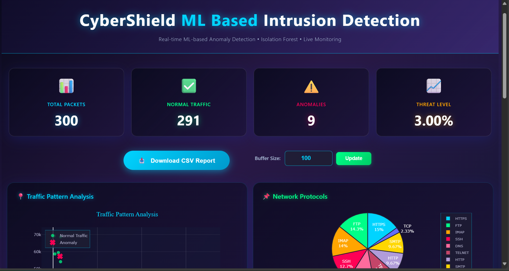
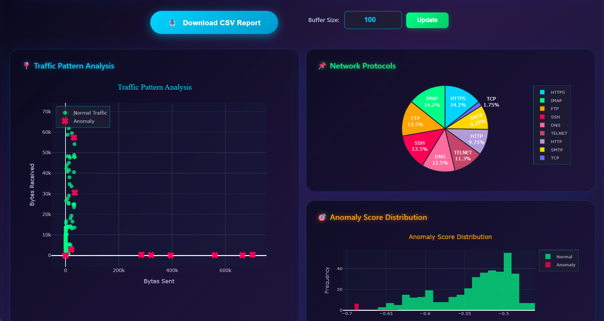
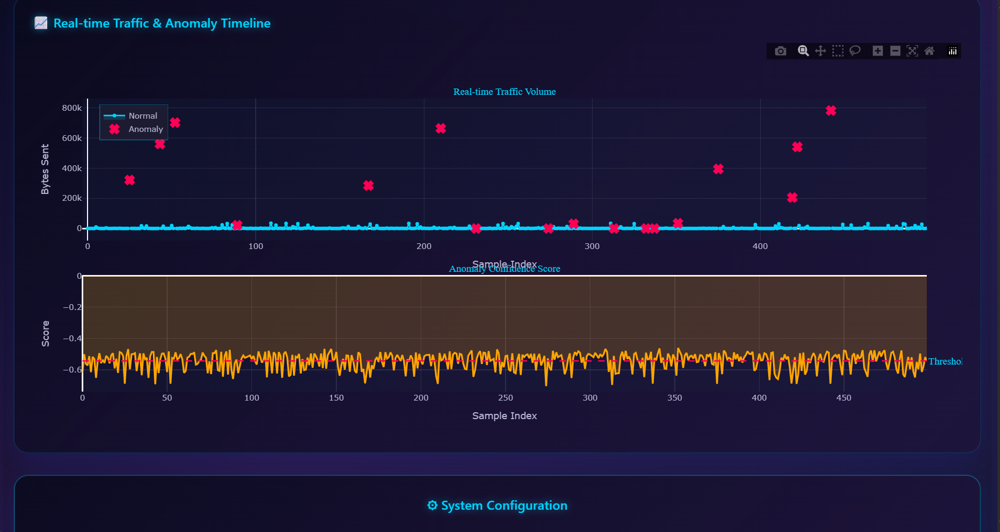

# CyberShield: ML-Based Network Intrusion Detection System

## Overview
This project is a real-time network anomaly detection system using machine learning. All components are now **fully integrated with no external dependencies**:

- **Direct Packet Capture:** Captures live network packets using Scapy
- **Real-time ML Processing:** Processes packets with Isolation Forest anomaly detection
- **Integrated Dashboard:** Live Dash web dashboard with anomaly visualization
- **Persistent Data Storage:** Stores all traffic data in JSON format for analysis

---

## Architecture

**Simplified Single-Process Architecture:**

```
┌──────────────────────────────────────────────────────────┐
│         network_anomaly_detector.py                      │
│  ┌─────────────────────────────────────────────────────┐ │
│  │ 1. Packet Sniffer (Scapy) - Background Thread      │ │
│  │    Captures live network packets                    │ │
│  └─────────────────────────────────────────────────────┘ │
│  ┌─────────────────────────────────────────────────────┐ │
│  │ 2. Real-time Processing & ML Detection             │ │
│  │    Isolation Forest Anomaly Detection              │ │
│  │    Updates persistent JSON storage                 │ │
│  └─────────────────────────────────────────────────────┘ │
│  ┌─────────────────────────────────────────────────────┐ │
│  │ 3. Dash Dashboard (http://127.0.0.1:8050)          │ │
│  │    Real-time visualizations & statistics           │ │
│  └─────────────────────────────────────────────────────┘ │
└──────────────────────────────────────────────────────────┘
```

---

## Prerequisites

- Python 3.8+
- `pip install -r requirements.txt`
- Administrator/root privileges (required for packet capture)

---

## Quick Start (Windows, macOS, Linux)

### 1. Install Dependencies

```bash
pip install -r requirements.txt
```

### 2. Run the Integrated Application

**On Windows (with Admin Privileges):**
```bash
python network_anomaly_detector.py
```

**On Linux/macOS (with sudo):**
```bash
sudo python network_anomaly_detector.py
# or
sudo python3 network_anomaly_detector.py
```

### 3. Access the Dashboard

Open your browser and go to: **http://127.0.0.1:8050**

---

## Features

✅ **Real-time Packet Capture** - Direct network traffic analysis using Scapy
✅ **ML-Based Anomaly Detection** - Isolation Forest algorithm for automatic threat detection
✅ **Interactive Dashboard** - Real-time visualizations with Plotly & Dash
✅ **Persistent Storage** - All traffic data saved to `network_traffic_data.json`
✅ **CSV Export** - Download traffic reports directly from the dashboard
✅ **Zero Configuration** - No external services or databases required
✅ **Single Process** - All components run in one unified application

---

## Dashboard Visualizations

The dashboard includes:

1. **Traffic Pattern Analysis** - Scatter plot of bytes sent vs received (Normal vs Anomalies)
2. **Network Protocols** - Pie chart distribution of protocols (TCP, UDP, ICMP, etc.)
3. **Anomaly Score Distribution** - Histogram of ML anomaly scores
4. **Real-time Timeline** - Time series plot showing traffic and anomaly trends
5. **Statistics Cards** - Total packets, normal traffic, anomalies, threat level percentage
6. **System Configuration** - Algorithm info and active settings

---

## How It Works

### Workflow

1. **Packet Capture**: Scapy captures all network packets from the system
2. **Feature Extraction**: 4 key features extracted per packet:
   - `bytes_sent` - Outgoing data size
   - `bytes_received` - Incoming data size
   - `packets` - Number of packets in the flow
   - `duration` - Connection duration
3. **ML Training**: After 200 samples, Isolation Forest model is trained
4. **Anomaly Detection**: Each new packet is scored; scores < -0.1 are marked as anomalies
5. **Dashboard Update**: Results updated in real-time (1-second refresh)
6. **Data Persistence**: All data saved to JSON file every 10 packets

### Anomaly Detection Algorithm

**Isolation Forest:**
- Unsupervised learning algorithm
- Auto-detects outliers without labeled training data
- Efficient for high-dimensional data
- Adaptive to changes in normal traffic patterns

---

## Configuration

Edit these settings in `network_anomaly_detector.py`:

```python
BUFFER_SIZE = 100                      # Packets to keep in memory
MAX_DISPLAY_POINTS = 500               # Dashboard points
INITIAL_TRAINING_SIZE = 200            # Samples before ML model trains
ANOMALY_SCORE_THRESHOLD = -0.1         # Threshold for anomaly detection
DATA_STORAGE_FILE = 'network_traffic_data.json'  # Persistent storage
CLEAR_DATA_ON_STARTUP = True           # Clear old data on restart
```

---

## Output Example

```
[NORMAL] TCP | 192.168.1.100:54321 -> 142.251.41.14:443
[NORMAL] UDP | 192.168.1.100:53456 -> 8.8.8.8:53
[ANOMALY] high_packet_rate | 192.168.1.50:12345 -> 10.0.0.5:80

Stats: 150 packets | Normal: 138 | Anomalies: 12 | Time: 0.5min
```

---

## Troubleshooting

### "Permission Denied" Error
- **Windows**: Run Command Prompt or PowerShell as Administrator
- **Linux/macOS**: Use `sudo` to run with elevated privileges

### Dashboard Not Loading
- Check if port 8050 is in use: `lsof -i :8050` (Linux/macOS)
- Try a different port by modifying: `app.run_server(port=8051)`

### No Packets Being Captured
- Verify network interface is active
- On Linux/macOS with WSL, ensure Scapy has correct interface access

### ML Model Not Training
- Wait for initial 200 samples to be collected (shown in console)
- Generate network traffic (ping, web browsing, etc.)
- Check console for training status messages


## Files Included

- `network_anomaly_detector.py` - **Main application** (all-in-one)
- `requirements.txt` - Python dependencies
- `network_traffic_data.json` - Persistent traffic data storage
- `README.md` - This file
- `TECHNICAL_REPORT.md` - Detailed technical documentation

---

## OLD FILES (Deprecated - Kafka Version)

The following files are from the previous Kafka-based architecture and are no longer needed:
- `packet_sniffer_windows.py` - Use `network_anomaly_detector.py` instead
- `consumer_plot.py` - Use `network_anomaly_detector.py` instead
- `producer.py` - Use `network_anomaly_detector.py` instead
- `requirements-windows.txt` - Use `requirements.txt` instead

---

## Performance Characteristics

- **Packet Processing**: Real-time, minimal latency
- **ML Inference**: ~1ms per prediction
- **Memory Usage**: ~200MB average
- **Dashboard Refresh**: 1 second interval
- **Data Persistence**: Saved every 10 packets

---

## License & Attribution

CyberShield - ML-Based Network Intrusion Detection System
Built with Python, Scapy, scikit-learn, Plotly, and Dash

---

## Support

For issues or questions, check the TECHNICAL_REPORT.md for detailed system documentation.
   ```
3. Open the provided local URL in your browser to view real-time analytics and anomaly detection.

---

## Files

- `packet_sniffer_windows.py` — Windows packet sniffer, streams to Kafka
- `producer.py` — Advanced traffic simulator (Linux, optional)
- `consumer_plot.py` — ML anomaly detection and dashboard (Linux)
- `network_traffic_data.json` — Persistent storage for traffic data
- `requirements.txt` — Python dependencies
- `screenshots/` — Example dashboard screenshots

---

## Troubleshooting

- **Kafka not reachable?**
  - Check firewall settings on both Windows and Linux.
  - Ensure `advertised.listeners` is set to the correct IP.
  - Use `telnet <kafka_ip> 9092` from Windows to test connectivity.
- **No packets detected?**
  - Make sure you are running the sniffer as Administrator.
  - Try generating traffic (ping, browsing, etc.) from other devices.
- **Dashboard not updating?**
  - Check that Kafka is running and the consumer is connected.
  - Look for errors in the terminal output.

---

## Credits

Developed by Prasad. Powered by Python, Kafka, Scapy, Dash, and scikit-learn.

## 🎯 Attack Detection Capabilities

The system can detect and classify the following attack patterns:

| Attack Type | Detection Rate | Characteristics |
|------------|----------------|-----------------|
| **DDoS Attack** | 3% of traffic | High packet count, short duration |
| **Port Scanning** | 2% of traffic | Sequential port probing |
| **Data Exfiltration** | 2% of traffic | Large outbound, minimal inbound |
| **Brute Force** | 1% of traffic | Repeated login attempts |
| **SQL Injection** | 1% of traffic | Unusual HTTP patterns, large responses |
| **DNS Tunneling** | 0.5% of traffic | Abnormal DNS query sizes |
| **Zero-Day Exploits** | 0.5% of traffic | Unusual protocol behavior |
| **Normal Traffic** | 90% of traffic | Baseline legitimate traffic |

## 📦 Prerequisites

### System Requirements
- **OS**: Linux (Ubuntu/Debian recommended), macOS, or Windows with WSL
- **RAM**: Minimum 4GB (8GB recommended)
- **Disk Space**: 2GB free space
- **Python**: 3.8 or higher
- **Java**: JDK 11 or higher (for Kafka)

### Required Software
- Git
- Python 3.8+
- Java JDK 11+
- Apache Kafka 4.0.0

## 🚀 Installation

### Step 1: Clone the Repository

```bash
# Clone the repository
git clone <your-repository-url>
cd "ml mini project"

# Or if you're starting fresh, create the directory
mkdir -p ~/ml\ mini\ project
cd ~/ml\ mini\ project
```

### Step 2: Install Java (if not already installed)

```bash
# Check if Java is installed
java -version

# If not installed, install OpenJDK 11
sudo apt update
sudo apt install openjdk-11-jdk -y

# Verify installation
java -version
```

### Step 3: Download and Install Apache Kafka 4.0.0

```bash
# Navigate to home directory
cd ~

# Download Kafka 4.0.0
wget https://downloads.apache.org/kafka/4.0.0/kafka_2.13-4.0.0.tgz

# Extract the archive
tar -xzf kafka_2.13-4.0.0.tgz

# Verify extraction
cd kafka_2.13-4.0.0
ls -la
```

### Step 4: Configure Kafka with KRaft Mode

```bash
# Generate a unique cluster ID
cd ~/kafka_2.13-4.0.0
KAFKA_CLUSTER_ID=$(bin/kafka-storage.sh random-uuid)
echo "Generated Cluster ID: $KAFKA_CLUSTER_ID"

# Format the storage directory
bin/kafka-storage.sh format -t $KAFKA_CLUSTER_ID -c config/kraft/server.properties

# You should see output like:
# Formatting metadata directory /tmp/kafka-logs with metadata.version 4.0-IV3.
```

### Step 5: Install Python Dependencies

```bash
# Navigate to project directory
cd ~/ml\ mini\ project

# Create a virtual environment (recommended)
python3 -m venv venv
source venv/bin/activate  # On Windows: venv\Scripts\activate

# Upgrade pip
pip install --upgrade pip

# Install required packages
pip install kafka-python
pip install pandas
pip install numpy
pip install scikit-learn
pip install dash
pip install plotly
pip install dash-bootstrap-components

# Or install all at once
pip install kafka-python pandas numpy scikit-learn dash plotly dash-bootstrap-components
```

### Step 6: Verify Installation

```bash
# Check Python packages
pip list | grep -E "kafka|pandas|numpy|scikit|dash|plotly"

# Expected output:
# dash                      2.x.x
# kafka-python              2.x.x
# numpy                     1.x.x
# pandas                    2.x.x
# plotly                    5.x.x
# scikit-learn              1.x.x
```

## 🎮 Running the Project

### Method 1: Using Multiple Terminals (Recommended)

#### Terminal 1: Start Kafka Server

```bash
cd ~/kafka_2.13-4.0.0
bin/kafka-server-start.sh config/kraft/server.properties
```

**Expected Output:**
```
[INFO] Registered kafka:type=kafka.Log4jController MBean
[INFO] Starting controller (kafka.server.ControllerServer)
[INFO] [SocketServer listenerType=CONTROLLER, nodeId=1] Created data-plane acceptor
```

Keep this terminal running. Kafka is now active on `localhost:9092`

#### Terminal 2: Start the Traffic Producer

```bash
cd ~/ml\ mini\ project
source venv/bin/activate  # Activate virtual environment
python3 producer.py
```

**Expected Output:**
```
======================================================================
🚀 Advanced Network Traffic Simulator v2.0
======================================================================
📊 Traffic Distribution:
  ✅ Normal Traffic: 90%
  🔴 Attack Patterns: 10%
     • DDoS Attacks: 3%
     • Port Scans: 2%
     ...
======================================================================
```

#### Terminal 3: Start the Consumer & Dashboard

```bash
cd ~/ml\ mini\ project
source venv/bin/activate  # Activate virtual environment
python3 consumer_plot.py
```

**Expected Output:**
```
======================================================================
Network Traffic Anomaly Detection System v2.2
======================================================================
Dashboard URL: http://localhost:8050
Model: Isolation Forest (Dynamic Threshold)
Initial Buffer Size: 100 samples
...
======================================================================
```

### Method 2: Using Background Processes

```bash
# Start Kafka in background
cd ~/kafka_2.13-4.0.0
nohup bin/kafka-server-start.sh config/kraft/server.properties > kafka.log 2>&1 &

# Wait for Kafka to fully start (10-15 seconds)
sleep 15

# Start producer in background
cd ~/ml\ mini\ project
source venv/bin/activate
nohup python3 producer.py > producer.log 2>&1 &

# Start consumer & dashboard
python3 consumer_plot.py
```

### Accessing the Dashboard

Once all services are running:

1. Open your web browser
2. Navigate to: `http://localhost:8050`
3. You should see the **CyberShield ML Based Intrusion Detection** dashboard

## 📊 Usage

### Dashboard Features

1. **Real-time Statistics**
   - Total packets processed
   - Normal traffic count
   - Anomaly count
   - Threat level percentage

2. **Interactive Visualizations**
   - Traffic Pattern Analysis (Scatter plot)
   - Protocol Distribution (Pie chart)
   - Anomaly Score Distribution (Histogram)
   - Real-time Traffic Timeline (Time series)

3. **Controls**
   - **Download CSV Report**: Export all traffic data with anomaly labels
   - **Buffer Size Adjustment**: Change the ML model's buffer size (10-1000 samples)

### Stopping the Services

```bash
# Stop the consumer (Ctrl+C in Terminal 3)
^C

# Stop the producer (Ctrl+C in Terminal 2)
^C

# Stop Kafka (Ctrl+C in Terminal 1)
^C

# Or if running in background:
pkill -f kafka
pkill -f producer.py
pkill -f consumer_plot.py
```

## 📁 Project Structure

```
ml mini project/
├── producer.py              # Network traffic simulator
├── consumer_plot.py         # ML detection engine & dashboard
├── network_traffic_data.json  # Persistent data storage (auto-generated)
├── README.md               # This file
└── venv/                   # Virtual environment (if created)
```

## ⚙️ Configuration

### Producer Configuration (`producer.py`)

```python
# Kafka settings
bootstrap_servers='localhost:9092'
topic='network_traffic'

# Traffic distribution (modify in generate_traffic method)
- Normal: 90%
- DDoS: 3%
- Port Scan: 2%
- Data Exfiltration: 2%
- Brute Force: 1%
- SQL Injection: 1%
- DNS Tunneling: 0.5%
- Zero-Day: 0.5%
```

### Consumer Configuration (`consumer_plot.py`)

```python
# Kafka settings
KAFKA_TOPIC = 'network_traffic'
KAFKA_SERVER = 'localhost:9092'

# ML Model settings
BUFFER_SIZE = 100                    # Processing buffer
MAX_DISPLAY_POINTS = 500            # Chart data points
INITIAL_TRAINING_SIZE = 200         # Initial training samples
ANOMALY_SCORE_THRESHOLD = -0.1      # Detection threshold

# Data persistence
DATA_STORAGE_FILE = 'network_traffic_data.json'
CLEAR_DATA_ON_STARTUP = True        # Clear old data on restart
```

### Kafka Configuration

Kafka settings are in `~/kafka_2.13-4.0.0/config/kraft/server.properties`:

```properties
# Default settings (usually don't need to change)
listeners=PLAINTEXT://localhost:9092
log.dirs=/tmp/kafka-logs
```

## 🖼️ Screenshots

### 📊 Dashboard Overview



The main dashboard displays real-time statistics including:
- **Total Packets Processed**: Live counter of all network traffic
- **Normal Traffic**: Count and percentage of legitimate traffic
- **Anomalies Detected**: Real-time threat detection count
- **Threat Level**: Current security threat percentage

Features include:
- **Download CSV Report**: Export complete traffic analysis
- **Dynamic Buffer Size Control**: Adjust ML model sensitivity (10-1000 samples)
- **Live Update Interval**: 1-second refresh rate

---

### 📍 Traffic Pattern Analysis


Interactive scatter plot visualization showing:
- **Green markers**: Normal traffic patterns (bytes sent vs received)
- **Red X markers**: Detected anomalies and attack patterns
- **Real-time clustering**: Visual identification of traffic behavior
- **Hover details**: Detailed packet information on mouse-over

This view helps identify:
- Data exfiltration (high outbound, low inbound)
- DDoS attacks (abnormal packet ratios)
- Port scanning activities
- Unusual protocol behavior

---

### 📌 Protocol Distribution & Anomaly Scores



Comprehensive network analysis featuring:

**Network Protocols Pie Chart:**
- Distribution across HTTP, HTTPS, FTP, SSH, DNS, SMTP, IMAP, TELNET
- Color-coded protocol identification
- Percentage breakdown of each protocol
- Helps identify protocol-based attacks

**Anomaly Score Distribution Histogram:**
- Visual representation of Isolation Forest confidence scores
- Separation between normal (green) and anomalous (red) traffic
- Threshold visualization for attack detection
- Statistical distribution of network behavior

---

### 📈 Real-time Timeline & Time Series



Dual-panel time series visualization:

**Top Panel - Traffic Volume:**
- Real-time bytes sent over time
- Blue line with area fill for normal traffic
- Red X markers highlighting detected attacks
- Trend analysis for traffic patterns

**Bottom Panel - Anomaly Confidence Score:**
- ML model confidence scores over time
- Orange threshold line for detection sensitivity
- Helps fine-tune detection parameters
- Historical attack pattern visibility

---

### ⚙️ System Configuration

The dashboard includes live system status:
- **Algorithm**: Isolation Forest (Unsupervised ML)
- **Detection Mode**: Auto (Dynamic threshold adjustment)
- **Active Buffer Size**: Configurable sample size for ML training
- **System Status**: 🟢 ACTIVE with real-time monitoring

## 🔧 Troubleshooting

### Issue: Kafka fails to start

**Solution:**
```bash
# Check if port 9092 is already in use
lsof -i :9092

# Kill the process if needed
kill -9 <PID>

# Clean Kafka logs and reformat
rm -rf /tmp/kafka-logs
cd ~/kafka_2.13-4.0.0
KAFKA_CLUSTER_ID=$(bin/kafka-storage.sh random-uuid)
bin/kafka-storage.sh format -t $KAFKA_CLUSTER_ID -c config/kraft/server.properties
```

### Issue: Python packages not found

**Solution:**
```bash
# Ensure virtual environment is activated
source venv/bin/activate

# Reinstall packages
pip install -r requirements.txt  # If you have requirements.txt
# Or install manually:
pip install kafka-python pandas numpy scikit-learn dash plotly
```

### Issue: Dashboard shows "No data"

**Solution:**
1. Ensure Kafka is running
2. Check producer is sending data: `cat producer.log`
3. Verify Kafka topic exists:
   ```bash
   cd ~/kafka_2.13-4.0.0
   bin/kafka-topics.sh --list --bootstrap-server localhost:9092
   ```
4. Recreate topic if needed:
   ```bash
   bin/kafka-topics.sh --create --topic network_traffic --bootstrap-server localhost:9092
   ```

### Issue: Port 8050 already in use

**Solution:**
```bash
# Find and kill the process
lsof -i :8050
kill -9 <PID>

# Or change the port in consumer_plot.py (last line):
app.run(debug=False, host="0.0.0.0", port=8051)  # Use different port
```

### Issue: Java not found

**Solution:**
```bash
# Install Java
sudo apt update
sudo apt install openjdk-11-jdk -y

# Set JAVA_HOME
echo 'export JAVA_HOME=/usr/lib/jvm/java-11-openjdk-amd64' >> ~/.bashrc
source ~/.bashrc
```

## 🛠️ Creating requirements.txt

Create a `requirements.txt` file for easier dependency management:

```bash
# Generate requirements.txt
pip freeze > requirements.txt

# Or create manually with these contents:
cat > requirements.txt << EOF
kafka-python==2.0.2
pandas==2.0.3
numpy==1.24.3
scikit-learn==1.3.0
dash==2.14.1
plotly==5.17.0
dash-bootstrap-components==1.5.0
EOF

# Install from requirements.txt
pip install -r requirements.txt
```

## 📚 Additional Resources

- [Apache Kafka Documentation](https://kafka.apache.org/documentation/)
- [Scikit-learn Isolation Forest](https://scikit-learn.org/stable/modules/generated/sklearn.ensemble.IsolationForest.html)
- [Dash Framework](https://dash.plotly.com/)
- [Plotly Python](https://plotly.com/python/)

## 🤝 Contributing

Contributions are welcome! Please feel free to submit a Pull Request.

1. Fork the repository
2. Create your feature branch (`git checkout -b feature/AmazingFeature`)
3. Commit your changes (`git commit -m 'Add some AmazingFeature'`)
4. Push to the branch (`git push origin feature/AmazingFeature`)
5. Open a Pull Request

## 📄 License

This project is licensed under the MIT License - see the LICENSE file for details.

## 👨‍💻 Author

**Prasad**

## 🙏 Acknowledgments

- Apache Kafka for stream processing
- Scikit-learn for machine learning capabilities
- Plotly & Dash for beautiful visualizations
- The cybersecurity community for attack pattern research

---

**⭐ If you find this project useful, please give it a star!**

## 📞 Support

For issues, questions, or suggestions:
- Open an issue on GitHub
- Contact: [Your Email/Contact Info]

---

**Last Updated**: October 2025
**Version**: 2.2
**Status**: Active Development
